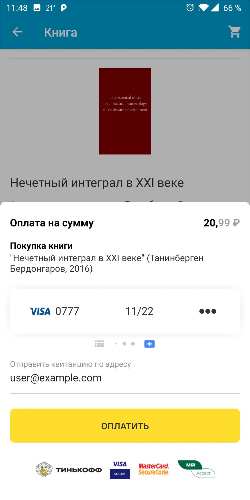
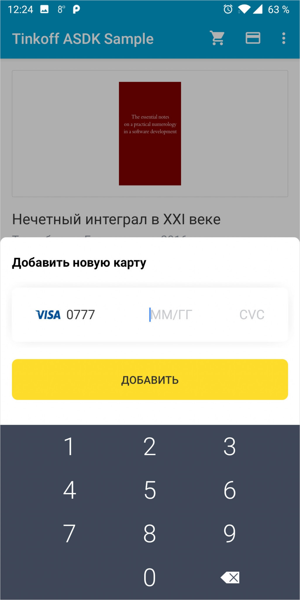

# Tinkoff Acquiring SDK for Android

[][search.maven]

 

Acquiring SDK позволяет интегрировать [Интернет-Эквайринг Tinkoff][acquiring] в мобильные приложения для платформы Android.

Возможности SDK:
- Прием платежей (в том числе рекуррентных);  
- Сохранение банковских карт клиента; 
- Сканирование и распознавание карт с помощью камеры или NFC;  
- Получение информации о клиенте и сохраненных картах;  
- Управление сохраненными картами;  
- Поддержка локализации;  
- Кастомизация экранов SDK;  
- Интеграция с онлайн-кассами; 
- Поддержка Google Pay и Системы быстрых платежей
- Оплата через Tinkoff Pay
- Совершение оплаты из уведомления

### Требования
Для работы Tinkoff Acquiring SDK необходим Android версии 5.0 и выше (API level 21).

### Подключение
Для подключения SDK добавьте в [_build.gradle_][build-config] вашего проекта следующие зависимости:
```groovy
implementation 'ru.tinkoff.acquiring:ui:$latestVersion'
implementation 'ru.tinkoff.acquiring:threeds-sdk:$latestVersion'
implementation 'ru.tinkoff.acquiring:threeds-wrapper:$latestVersion'
```
Если вы хотите внедрить сканирование с помощью библиотеки Card-IO, то необходимо добавить в [_build.gradle_][build-config]
```groovy
implementation 'ru.tinkoff.acquiring:cardio:$latestVersion'
```

### Подготовка к работе
Для начала работы с SDK вам понадобятся:
* Terminal key
* Public key

Которые выдаются после подключения к [Интернет-Эквайрингу][acquiring].

SDK позволяет настроить режим работы (debug/prod). По умолчанию - режим prod.
Чтобы настроить debug режим, установите параметры:
```kotlin
AcquiringSdk.isDeveloperMode = true // используется тестовый URL, деньги с карт не списываются
AcquiringSdk.isDebug = true         // включение логирования запросов
```

Кроме того, в некоторых случаях к запросам к API эквайринга необходимо добавлять некий токен (подпись
запроса). Передача токена для SDK терминалов в общем случае не обязательна и зависит от настроек 
терминала. Задание способа генерации токена в случаях, когда это необходимо, может выглядеть следующим 
образом (для более подробной информации см. kDoc `AcquiringSdk.tokenGenerator`):
```kotlin
AcquiringSdk.tokenGenerator = SampleAcquiringTokenGenerator(password) // генерация токена с использованием пароля
// В целях безопасности не рекомендуется хранить пароль в коде приложения
```

### Пример работы
Для проведения оплаты необходимо вызвать метод **TinkoffAcquiring**#_openPaymentScreen_. Метод запустит экран оплаты **PaymentActivity**. Активити должна быть настроена на обработку конкретного платежа, поэтому в метод необходимо передать настройки проведения оплаты, включающие в себя данные заказа, данные покупателя и опционально параметры кастомизации экрана оплаты.
Кроме того, можно указать тему, указать локализацию формы (или передать свою), а также указать модуль для сканирования (свой или **CameraCardIOScanner**).

```kotlin
val paymentOptions = 
        PaymentOptions().setOptions {
            orderOptions {                          // данные заказа
                orderId = "ORDER-ID"                // ID заказа в вашей системе
                amount = Money.ofRubles(1000)       // сумма для оплаты
                title = "НАЗВАНИЕ ПЛАТЕЖА"          // название платежа, видимое пользователю
                description = "ОПИСАНИЕ ПЛАТЕЖА"    // описание платежа, видимое пользователю
                recurrentPayment = false            // флаг определяющий является ли платеж рекуррентным [1]
                successURL  = "URL"                 // URL, куда будет переведен покупатель в случае успешной оплаты (см. полную документацию)
                failURL = "URL"                     // URL, куда будет переведен покупатель в случае неуспешной оплаты (см. полную документацию)
            }   
            customerOptions {                       // данные покупателя
                checkType = CheckType.NO.toString() // тип привязки карты
                customerKey = "CUSTOMER_KEY"        // уникальный ID пользователя для сохранения данных его карты
                email = "batman@gotham.co"          // E-mail клиента для отправки уведомления об оплате
            }   
            featuresOptions {                       // настройки визуального отображения и функций экрана оплаты
                useSecureKeyboard = true            // флаг использования безопасной клавиатуры [2]
                cameraCardScanner = CameraCardIOScanner()
                theme = themeId
            }
        }

val tinkoffAcquiring = TinkoffAcquiring(applicationContext, "TERMINAL_KEY", "PUBLIC_KEY") // создание объекта для взаимодействия с SDK и передача данных продавца
tinkoffAcquiring.openPaymentScreen(this@MainActivity, paymentOptions, PAYMENT_REQUEST_CODE)
```
Результат вызова метода вернется в **onActivityResult**:
- при успешном платеже (_Activity.RESULT_OK_) возвращается _TinkoffAcquiring.EXTRA_PAYMENT_ID_ - идентификатор платежа типа Long, опционально _TinkoffAcquiring.EXTRA_CARD_ID_ - id карты, с которой проводился платеж, тип String и опционально _TinkoffAcquiring.EXTRA_REBILL_ID_ - rebillId карты, если был совершен рекуррентный платеж, тип String
- при неуспешном платеже (_TinkoffAcquiring.RESULT_ERROR_) возвращается ошибка _TinkoffAcquiring.EXTRA_ERROR_ типа Throwable (подробнее о возвращаемых ошибках в [документации][full-doc])

Можно передать данные чека, указав параметр **receipt** в методе **PaymentOptions**#_orderOptions_ и передать дополнительные параметры **additionalData**. Эти объекты при их наличии будут переданы на сервер с помощью метода [**API Init**][init-documentation], где можно посмотреть их детальное описание.

```kotlin
val paymentOptions = 
        PaymentOptions().setOptions {
            orderOptions {               
                receipt = myReceipt
                additionalData = dataMap
                // другие параметры заказа
            }
            customerOptions {                    
                // данные покупателя
            }
            featuresOptions {                    
                // настройки визуального отображения и функций экрана оплаты
            }
        }

val tinkoffAcquiring = TinkoffAcquiring(applicationContext, "TERMINAL_KEY", "PUBLIC_KEY")
tinkoffAcquiring.openPaymentScreen(this@MainActivity, paymentOptions, PAYMENT_REQUEST_CODE)
```
[1] _Рекуррентный платеж_ может производиться для дальнейшего списания средств с сохраненной карты, без ввода ее реквизитов. Эта возможность, например, может использоваться для осуществления платежей по подписке.

[2] _Безопасная клавиатура_ используется вместо системной и обеспечивает дополнительную безопасность ввода, т.к. сторонние клавиатуры на устройстве клиента могут перехватывать данные и отправлять их злоумышленнику.


### Экран привязки карт
Для запуска экрана привязки карт необходимо запустить **TinkoffAcquiring**#_openAttachCardScreen_. В метод также необходимо передать некоторые параметры - тип привязки, данные покупателя и опционально параметры кастомизации (по-аналогии с экраном оплаты):
```kotlin
val attachCardOptions = 
        AttachCardOptions().setOptions {
            customerOptions {                       // данные покупателя
                customerKey = "CUSTOMER_KEY"        // уникальный ID пользователя для сохранения данных его карты
                checkType = CheckType.NO.toString() // тип привязки карты
                email = "batman@gotham.co"          // E-mail клиента для отправки уведомления о привязке
            }
            featuresOptions {                       // настройки визуального отображения и функций экрана оплаты
                useSecureKeyboard = true
                cameraCardScanner = CameraCardIOScanner()
                theme = themeId
            }
        }

val tinkoffAcquiring = TinkoffAcquiring(applicationContext, "TERMINAL_KEY", "PUBLIC_KEY")
tinkoffAcquiring.openAttachCardScreen(this@MainActivity, attachCardOptions, ATTACH_CARD_REQUEST_CODE)
```
Результат вызова метода вернется в **onActivityResult**:
- при успешной привязке (_Activity.RESULT_OK_) возвращается _TinkoffAcquiring.EXTRA_CARD_ID_ - id карты, которая была привязана, тип String
- при неуспешной привязке (_TinkoffAcquiring.RESULT_ERROR_) возвращается ошибка _TinkoffAcquiring.EXTRA_ERROR_ типа Throwable (подробнее о возвращаемых ошибках в [документации][full-doc])


### Google Pay

[Документация](https://developers.google.com/pay)

Для включения Google Pay необходимо:

Добавить мета информацию в манифест приложения

```xml
<meta-data
    android:name="com.google.android.gms.wallet.api.enabled"
    android:value="true" />
```

Вставить кнопку в разметку интерфейса в соответствии с [Правилами использования бренда Google Pay][google-pay-brand]

Сконфигурировать параметры в коде приложения.
Для упрощения работы с Google Pay, Acquiring SDK берет на себя работу по настройке параметров, конфигурации Google Pay, предоставляя интерфейс для вызова необходимых методов **GooglePayHelper**.

Пример работы с Google Pay:
```kotlin
fun setupGooglePay() {
    val googlePayButton = findViewById<View>(R.id.btn_google_pay) // определяем кнопку, вставленную в разметку

    val googleParams = GooglePayParams("TERMINAL_KEY",     // конфигурируем основные параметры
            environment = WalletConstants.ENVIRONMENT_TEST // тестовое окружение
    )

    val googlePayHelper = GooglePayHelper(googleParams) // передаем параметры в класс-помощник

    googlePayHelper.initGooglePay(this) { ready ->      // вызываем метод для определения доступности Google Pay на девайсе
        if (ready) {                                    // если Google Pay доступен и настроен правильно, по клику на кнопку открываем экран оплаты Google Pay
            googlePayButton.setOnClickListener {
                googlePayHelper.openGooglePay(this@MainActivity, Money.ofRubles(1000), GOOGLE_PAY_REQUEST_CODE)
            }
        } else {
            googlePayButton.visibility = View.GONE      // если Google Pay недоступен на девайсе, необходимо скрыть кнопку
        }         
    }
}
```
При открытии экрана Google Pay с помощью метода **GooglePayHelper**#_openGooglePay_, необходимо передать в метод контекст, сумму к оплате и requestCode. После завершения работы экрана Google Pay, в метод **onActivityResult** придут данные с результатом проведения операции и токеном Google Pay. 
Токен и параметры заказа необходимо далее передать в Acquiring SDK, вызвав соответствующий метод совершения платежа без открытия экрана:

```kotlin
fun handleGooglePayResult(resultCode: Int, data: Intent?) {
    if (data != null && resultCode == Activity.RESULT_OK) {
    
        val token = GooglePayHelper.getGooglePayToken(data) // получаем токен Google Pay из Intent
        
        val tinkoffAcquiring = TinkoffAcquiring(applicationContext, "TERMINAL_KEY", "PUBLIC_KEY")
        tinkoffAcquiring.initPayment(token, paymentOptions) // вызывов метода совершения платежа
                .subscribe(paymentListener)                 // подписываемся на события в процессе оплаты
                .start()                                    // запуск процесса оплаты
    }
}
```

### Система быстрых платежей
Включение причема платежей через Систему быстрых платежей осуществляется в Личном кабинете.
#### Включение приема оплаты через СБП по кнопке для покупателя:
При конфигурировании параметров экрана оплаты, необходимо передать соответствующий параметр в featuresOptions. По умолчанию Система быстрых платежей в SDK отключена.

```kotlin
var paymentOptions = PaymentOptions().setOptions {
    orderOptions { /*options*/ }
    customerOptions { /*options*/ }
    featuresOptions {
        fpsEnabled = true         
    }
}
```

#### Прием оплаты по статическому QR коду через СБП
Чтобы реализовать оплату с помощью статического QR кода на экране приложения, необходимо:
1) Создать соответствующую кнопку приема оплаты в приложении кассира
2) Установить слушатель на клик по кнопке и вызвать в нем метод **TinkoffAcquiring**#_openStaticQrScreen_
Метод openStaticQrScreen принимает параметры: activity, localization - для локализации сообщения на экране, requestCode - для получения ошибки, если таковая возникнет.
Результат оплаты товара покупателем по статическому QR коду не отслеживается в SDK, соответственно в onActivityResult вызывающего экран активити может вернуться только ошибка или отмена (закрытие экрана).

### Tinkoff Pay
Включение приема платежей через Tinkoff Pay осуществляется в Личном кабинете.
#### Включение приема оплаты через Tinkoff Pay по кнопке для покупателя:
При инициализации экрана оплаты SDK проверит наличие возможности оплаты через Tinkoff Pay и в зависимости от результата отобразит
кнопку оплаты. Отключить отображение кнопки программно можно с помощью параметра `tinkoffPayEnabled` в `featuresOptions`.

```kotlin
var paymentOptions = PaymentOptions().setOptions {
    orderOptions { /*options*/ }
    customerOptions { /*options*/ }
    featuresOptions {
        tinkoffPayEnabled = false // отключение отображения кнопки оплаты через Tinkoff Pay; по умолчанию отображение включено
    }
}
```

Для определения возможности оплаты через Tinkoff Pay SDK посылает запрос на "https://securepay.tinkoff.ru/v2/TinkoffPay/terminals/$terminalKey/status".
Результат выполнения запроса кэшируется в SDK на период в 5 минут для уменьшения количества исходящих запросов.

Для отображения кнопки оплаты через Tinkoff Pay внутри вашего приложения (вне экрана оплаты, предоставляемого SDK) необходимо:
1. Самостоятельно вызвать метод определения доступности оплаты через Tinkoff Pay. Для этого можно использовать метод `TinkoffAcquiring.checkTinkoffPayStatus`
2. При наличии возможности оплаты отобразить кнопку оплаты через Tinkoff Pay в вашем приложении в соответствии с Design Guidelines
3. По нажатию на кнопку создать процесс оплаты с помощью метода `TinkoffAcquiring.payWithTinkoffPay` (параметр `version` можно получить
из ответа на шаге 1), зарегистрировать в нем слушатель событий (c обработкой состояния `OpenTinkoffPayBankState` в методе `onUiNeeded` и
использующий `state.deepLink` для открытия приложения с формой оплаты) и запустить процесс оплаты (метод `start()`)
4. При необходимости, проверить статус платежа при помощи `TinkoffAcquiring.sdk.getState` (с указанием `paymentId` полученном в `state.paymentId` на
предыдущем шаге); время и частота проверки статуса платежа зависит от нужд клиентского приложения и остается на ваше усмотрение (один из вариантов -
проверять статус платежа при возвращении приложения из фона)

### Yandex Pay
AcquiringSdk имеет возможность использовать внутри себя Yandex Pay в качестве хранилища карт.
Внимание, этот функционал поддерживается только с версии Android 6.0 Marshmallow и выше.

Если вы хотите использовать Yandex Pay вместе с AcquiringSdk вам необходимо:
1. Получить в личном кабинете [Yandex](https://pay.yandex.ru/ru/docs/psp/android-sdk) значение `YANDEX_CLIENT_ID`
2. Укажите полученный `YANDEX_CLIENT_ID` в сборочном скрипте [_build.gradle_][build-config] в качестве значения в `manifestPlaceholders`:
```groovy
android {
  defaultConfig {
    manifestPlaceholders = [
      // Подставьте ваш yandex_client_id
      YANDEX_CLIENT_ID: "12345678901234567890",
    ]
  }
}
```
3. Добавить в [_build.gradle_][build-config]
```groovy
implementation 'ru.tinkoff.acquiring:yandexpay:$latestVersion'
```
Крайне не рекомендуется использовать `ru.tinkoff.acquiring:yandexpay` вместе с `com.yandex.pay:core` в рамках вашего приложения, так как
могут возникнуть непредвиденные ошибки.

4. Включить прием платежей через Yandex Pay в Личном кабинете.
5. Проверить Доступ функционала Yandex Pay проверяется через метод `TinkoffAcquiring#checkTerminalInfo`, который возвращает данные обо всех методах оплаты,извлечь данные касательно Yandex Pay  расширение `TerminalInfo#mapYandexPayData`.
6. Кнопка Yandex Pay инкапсулирована во фрагменте `YandexButtonFragment`. Размеры фрагмента-кнопки можете создать самостоятельно, однако если рекомендации по минимальной ширине. Фрагмент можно создать с помощью метода `TinkoffAcquiring.createYandexPayButtonFragment`.
После выбора карты процесс оплаты запуститься самостоятельно. Возможности кастомизации можно посмотреть в [pages](https://github.com/Tinkoff/AcquiringSdkAndroid/wiki/Yandex-pay-in-ASDK).

### Дополнительные возможности

#### Настройка стилей
В приложении есть базовая тема AcquiringTheme. Для изменения темы необходимо переопределить атрибуты.
На всех экранах SDK используется одна и та же тема.

#### Локализация
SDK имеет поддержку настройки локализации интерфейса, которая может не зависеть от локали устройства.
В SDK реализовано 2 языковые локализации - русская и английская. Чтобы установить локализацию из SDK, необходимо передать в параметр настройки экрана объект AsdkSource и указать его параметр Language.RU или Language.EN.

```kotlin
var paymentOptions = PaymentOptions().setOptions {
    orderOptions { /*options*/ }
    customerOptions { /*options*/ }
    featuresOptions {
        localizationSource = AsdkSource(Language.RU)         
    }
}
```

По умолчанию, если в localizationSource не задан, определяется и используется локаль устройства.
Файлы локализации имеют формат json, где ключом является место использования строки на форме, значением - перевод.
Существует возможность добавить свои локализации на другие языки. Подробнее см. [файл полной документации][full-doc].

#### Проведение платежа без открытия экрана оплаты
Для проведения платежа без открытия экрана необходимо вызвать метод **TinkoffAcquiring**#_initPayment_, который запустит процесс оплаты с инициацией и подтверждением платежа (будут вызваны методы API Init и FinishAuthorize). 
В параметры метода необходимо передать карточные данные для оплаты или Google Pay токен, и параметры платежа PaymentOptions
За выполнение методов отвечает объект SDK PaymentProcess, который имеет возможность уведомлять слушателя о событиях в процессе выполнения, методы подписки и отписки от событий, а также методы старта и остановки процесса. 
Методы выполняются асинхронно.

Пример запуска платежа:
```kotlin 
TinkoffAcquiring.initPayment(token, paymentOptions) // создание процесса платежа
                .subscribe(paymentListener)         // подписка на события процесса
                .start()                            // запуск процесса
```

#### Завершение оплаты с уже существующим paymentId
Для отображения платежной формы и проведения платежа без вызова метода Init можно передать
значение `SelectCardAndPayState` при вызове `openPaymentScreen`, пример вызова:
```kotlin
val paymentId = 123456789L // некоторый paymentId, полученный ранее при вызове метода Init
tinkoffAcquiring.openPaymentScreen(this@MainActivity, paymentOptions, PAYMENT_REQUEST_CODE, SelectCardAndPayState(paymentId))
```

Для завершения платежа без отображения платежной формы можно использовать метод `TinkoffAcquiring.finishPayment`.

### Структура
SDK состоит из следующих модулей:

#### Core
Является базовым модулем для работы с Tinkoff Acquiring API. Модуль реализует протокол взаимодействия с сервером и позволяет не осуществлять прямых обращений в API. Не зависит от Android SDK и может использоваться в standalone Java приложениях.

Основной класс модуля - **AcquiringSdk** - предоставляет интерфейс для взаимодействия с Tinkoff Acquiring API. Для работы необходимы ключи продавца (см. **Подготовка к работе**).

Подключение:
```groovy
implementation 'ru.tinkoff.acquiring:core:$latestVersion'
```

#### UI
Содержит интерфейс, необходимый для приема платежей через мобильное приложение.

Основной класс - **TinkoffAcquiring** - позволяет:
* открывать экран совершения платежа
* открывать экран привязки карты
* открывать экран оплаты по статическому QR коду
* проводить полную сессию платежа без открытия экранов, с передачей платежных данных
* проводить только подтверждение платежа без открытия экранов, с передачей платежных данных
* настроить экран для приема оплаты из уведомления

#### Card-IO
Модуль для сканирования карты камерой телефона с помощью библиотеки Card-IO.

#### Sample
Содержит пример интеграции Tinkoff Acquiring SDK и модуля сканирования Card-IO в мобильное приложение по продаже книг.

### Proguard
```
-keep class ru.tinkoff.acquiring.sdk.localization.** { *; }
-keep class ru.tinkoff.acquiring.sdk.requests.** { *; }
-keep class ru.tinkoff.acquiring.sdk.models.** { *; }
-keep class ru.tinkoff.acquiring.sdk.yandexpay.models.** { *; } // если подключали яндекс
-keep class ru.rtln.tds.sdk.** { *; }
-keep class org.spongycastle.**
-keep class org.bouncycastle.**
```

### Поддержка
- По возникающим вопросам просьба обращаться на [oplata@tinkoff.ru][support-email]
- Баги и feature-реквесты можно направлять в раздел [issues][issues]
- Документация на [GitHub Pages](https://tinkoff.github.io/AcquiringSdkAndroid/ui/ru.tinkoff.acquiring.sdk/-tinkoff-acquiring/index.html)

[search.maven]: http://search.maven.org/#search|ga|1|ru.tinkoff.acquiring.ui
[build-config]: https://developer.android.com/studio/build/index.html
[support-email]: mailto:oplata@tinkoff.ru
[issues]: https://github.com/Tinkoff/AcquiringSdkAndroid/issues
[acquiring]: https://www.tinkoff.ru/kassa/
[init-documentation]: https://oplata.tinkoff.ru/develop/api/payments/init-request/
[google-pay-brand]: https://developers.google.com/pay/api/android/guides/brand-guidelines
[full-doc]: https://github.com/Tinkoff/AcquiringSdkAndroid/blob/master/Android%20SDK.pdf
