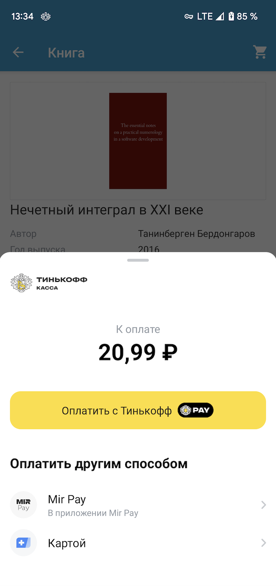
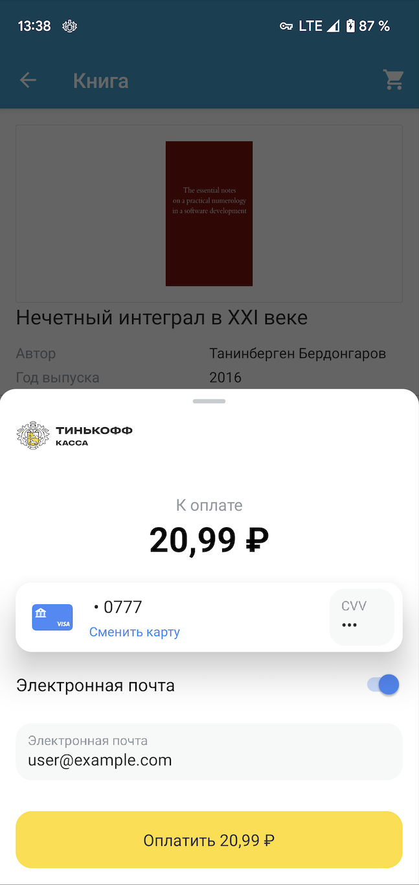

# Tinkoff Acquiring SDK for Android

[][search.maven]

 

Acquiring SDK позволяет интегрировать [Интернет-Эквайринг Tinkoff][acquiring] в мобильные приложения для платформы Android.

Возможности SDK:
- Прием платежей (в том числе рекуррентных);  
- Сохранение банковских карт клиента; 
- Сканирование и распознавание карт с помощью камеры или NFC;  
- Получение информации о клиенте и сохраненных картах;  
- Управление сохраненными картами;  
- Поддержка локализации;  
- Кастомизация экранов SDK;  
- Интеграция с онлайн-кассами; 
- Поддержка Системы быстрых платежей
- Оплата через Tinkoff Pay
- Оплата через Mir Pay
- Оплата с помощью Yandex Pay

### Требования
Для работы Tinkoff Acquiring SDK необходим Android версии 7.0 и выше (API level 24).

### Подключение
Для подключения SDK добавьте в [_build.gradle_][build-config] вашего проекта следующие зависимости:
```groovy
implementation 'ru.tinkoff.acquiring:ui:$latestVersion'
implementation 'ru.tinkoff.acquiring:threeds-sdk:$latestVersion'
implementation 'ru.tinkoff.acquiring:threeds-wrapper:$latestVersion'
```
Если вы хотите внедрить сканирование с помощью библиотеки Card-IO, то необходимо добавить в [_build.gradle_][build-config]
```groovy
implementation 'ru.tinkoff.acquiring:cardio:$latestVersion'
```

Так же необходимо добавить в [_network-security-config_][network-security-config] содержащий 
сертификаты от минцифр и доп. сертификат от тинькофф. Пример можно посмотреть в `sample` выглядит он так:
```xml
<?xml version="1.0" encoding="utf-8"?>
<network-security-config>
    <base-config>
        <trust-anchors>
            <certificates src="system" />
            <certificates src="@raw/acq_tinkoff_root_cert" />
            <certificates src="@raw/acq_ministry_of_digital_development_root_cert" />
        </trust-anchors>
    </base-config>
</network-security-config>
```

### Подготовка к работе
Для начала работы с SDK вам понадобятся:
* Terminal key
* Public key

Которые выдаются после подключения к [Интернет-Эквайрингу][acquiring]

Подробнее о настройке Личного кабинета можно прочитать [тут](./PersonalAccountSettings.md)

SDK позволяет настроить режим работы (debug/prod). По умолчанию - режим prod.
Чтобы настроить debug режим, установите параметры:
```kotlin
AcquiringSdk.isDeveloperMode = true // используется тестовый URL, деньги с карт не списываются
AcquiringSdk.isDebug = true         // включение логирования запросов
```

Кроме того, в некоторых случаях к запросам к API эквайринга есть возможность добавлять некий токен (подпись запроса).
Задание способа генерации токена в случаях, когда это необходимо, может выглядеть следующим образом
(для более подробной информации см. kDoc `AcquiringSdk.tokenGenerator`): 
```kotlin
AcquiringSdk.tokenGenerator = SampleAcquiringTokenGenerator(password) // генерация токена с использованием пароля
// В целях безопасности не рекомендуется хранить пароль в коде приложения
```

### Пример работы
Для начала необходимо создать **TinkoffAcquiring** 
```kotlin
val tinkoffAcquiring = TinkoffAcquiring(applicationContext, "TERMINAL_KEY", "PUBLIC_KEY") // создание объекта для взаимодействия с SDK и передача данных продавца
``` 
Далее необходимо проинициализировать платежные сессии методов оплаты:
```kotlin
tinkoffAcquiring.initSbpPaymentSession()
tinkoffAcquiring.initTinkoffPayPaymentSession()
tinkoffAcquiring.initMirPayPaymentSession()
```
> **Примечание**
> Для того чтобы не инициализировать все платежные сессии, можно предварительно 
> вызвать метод **TinkoffAcquiring.checkTerminalInfo()** для получения списка 
> актуальных способов оплаты и произвести инициализации платежных сессий только для них. 

Далее необходимо настроить экран с формой оплаты на обработку конкретного 
платежа с помощью **PaymentOptions** которые состоят из настроек проведения 
оплаты, в том числе данные заказа, данные покупателя и опционально параметры 
кастомизации экрана оплаты. Так же можно указать модуль для сканирования
(свой или **CardScannerDelegate**). Локализация берется из системы, 
так же имеется поддержка светлой и тёмной темы. Внешний вид экрана и набор 
компонентов определяется из доступных методов оплаты, настраивается в личном кабинете.
```kotlin
val paymentOptions =
    PaymentOptions().setOptions {
        orderOptions {                          // данные заказа
            orderId = "ORDER-ID"                // ID заказа в вашей системе
            amount = Money.ofRubles(1000)       // сумма для оплаты
            title = "НАЗВАНИЕ ПЛАТЕЖА"          // название платежа, видимое пользователю
            description = "ОПИСАНИЕ ПЛАТЕЖА"    // описание платежа, видимое пользователю
            recurrentPayment = false            // флаг определяющий является ли платеж рекуррентным [1]
            successURL  = "URL"                 // URL, куда будет переведен покупатель в случае успешной оплаты (см. полную документацию)
            failURL = "URL"                     // URL, куда будет переведен покупатель в случае неуспешной оплаты (см. полную документацию)
        }
        customerOptions {                       // данные покупателя
            checkType = CheckType.NO.toString() // тип привязки карты
            customerKey = "CUSTOMER_KEY"        // уникальный ID пользователя для сохранения данных его карты
            email = "batman@gotham.co"          // E-mail клиента для отправки уведомления об оплате
        }
        featuresOptions {                       // настройки визуального отображения и функций экрана оплаты
            cameraCardScanner =
                CardScannerDelegateImpl()       // реализация механизма сканирования карт, можно использовать встроенный CardScannerWrapper
        }
    }
```
Затем регистрируем контракт **MainFormContract**#_Contract_, и вызываем метод **ActivityResultLauncher**#_launch_
```kotlin
val byMainFormPayment = registerForActivityResult(MainFormLauncher.Contract, ActivityResultCallback {})
byMainFormPayment.launch(MainFormContract.StartData(paymentOptions))
```
Результат платежа вернется в **ActivityResultCallback**:
- при успешном платеже возвращается _MainFormLauncher.Success_ - содержащий _paymentId_ идентификатор платежа, опционально _cardId_ - id карты, с которой проводился платеж, тип String и опционально _rebillId_ - rebillId карты, если был совершен рекуррентный платеж
- при неуспешном платеже (_MainFormLauncher.Error_) содержащий Throwable (подробнее о возвращаемых ошибках в [документации][full-doc])
- при отмене платежа (_MainFormLauncher.Canceled_)

Можно так же передать данные чека, указав параметр **receipt** в методе **PaymentOptions**#_orderOptions_ и передать дополнительные параметры **additionalData**. Эти объекты при их наличии будут переданы на сервер с помощью метода [**API Init**][init-documentation], где можно посмотреть их детальное описание.

```kotlin
val paymentOptions = 
        PaymentOptions().setOptions {
            orderOptions {               
                receipt = myReceipt
                additionalData = dataMap
                // другие параметры заказа
            }
            customerOptions {                    
                // данные покупателя
            }
            featuresOptions {                    
                // настройки визуального отображения и функций экрана оплаты
            }
        }

val byMainFormPayment = registerForActivityResult(MainFormContract.Contract)
byMainFormPayment.launch(MainFormContract.StartData(paymentOptions))
```
[1] _Рекуррентный платеж_ может производиться для дальнейшего списания средств с сохраненной карты, без ввода ее реквизитов. Эта возможность, например, может использоваться для осуществления платежей по подписке.

[2] _Безопасная клавиатура_ используется вместо системной и обеспечивает дополнительную безопасность ввода, т.к. сторонние клавиатуры на устройстве клиента могут перехватывать данные и отправлять их злоумышленнику.


### Экран привязки карт
Для запуска экрана привязки карт необходимо зарегестирировать **AttachCardLauncher**#_Contract_. В метод также необходимо передать некоторые параметры - тип привязки, данные покупателя и опционально параметры кастомизации (по-аналогии с экраном оплаты):
```kotlin
val attachCardOptions = 
        AttachCardOptions().setOptions {
            setTerminalParams("TERMINAL_KEY", "PUBLIC_KEY")
            customerOptions {                       // данные покупателя
                customerKey = "CUSTOMER_KEY"        // уникальный ID пользователя для сохранения данных его карты
                checkType = CheckType.NO.toString() // тип привязки карты
                email = "batman@gotham.co"          // E-mail клиента для отправки уведомления о привязке
            }
            featuresOptions {                       // настройки визуального отображения и функций экрана оплаты
                useSecureKeyboard = true
                cameraCardScanner = CameraCardIOScanner()
                theme = themeId
            }
        }

attachCard = registerForActivityResult(AttachCard.Contract, ActivityResultCallback {})
attachCard.launch(options)
```
Результат вызова метода вернется в **ActivityResultCallback** в виде **AttachCard.Result**:
- при успешной привязке (_AttachCard.Success_) возвращается _cardId_ - id карты, которая была привязана, тип String
- при неуспешной привязке (_AttachCard.Error_) возвращается ошибка _error_ типа Throwable (подробнее о возвращаемых ошибках в [документации][full-doc])


### Система быстрых платежей
Включение приема платежей через Систему быстрых платежей осуществляется в Личном кабинете.
#### Прием оплаты по статическому QR коду через СБП
Чтобы реализовать оплату с помощью статического QR кода на экране приложения, необходимо:
1. Создать соответствующую кнопку приема оплаты в приложении кассира
2. Установить слушатель на клик по кнопке и вызвать в нем метод **TinkoffAcquiring**#_openStaticQrScreen_
Метод openStaticQrScreen принимает параметры: activity, localization - для локализации сообщения на экране, requestCode - для получения ошибки, если таковая возникнет.
Результат оплаты товара покупателем по статическому QR коду не отслеживается в SDK, соответственно в onActivityResult вызывающего экран активити может вернуться только ошибка или отмена (закрытие экрана).


### Tinkoff Pay
Включение приема платежей через Tinkoff Pay осуществляется в Личном кабинете.
#### Включение приема оплаты через Tinkoff Pay по кнопке для покупателя:
Оплату с помощью Tinkoff Pay по кнопке можно настроить двумя способами
1. с использованием экранов из SDK;
2. с использованием своих экранов и `TpayProcess` из SDK.

Оба варианта содержат общие шаги описанные ниже:
1. Для начала необходимо вызвать метод `TinkoffAcquiring.checkTerminalInfo`, в котором можно проверить доступность метода оплаты с помощью расширения `enableTinkoffPay()`.
2. Если `enableTinkoffPay()` возвращает `true`, то можно отобразить кнопку оплаты Tinkoff Pay в вашем приложении в соответствии с Design Guidelines.

##### Использование готовых экранов SDK
3. По нажатию на кнопку инициализировать платежную сессию и запустить экран оплаты SDK: 
```kotlin
TinkoffAcquiring.initTinkoffPayPaymentSession()

val tpayPayment = registerForActivityResult(TpayLauncher.Contract, ActivityResultCallback {})

// настраиваются по аналогии с экраном оплаты
val paymentOptions = PaymentOptions()
            .setOptions {
                orderOptions { ... }
                customerOptions { ... }
                featuresOptions { ... }
                setTerminalParams("TERMINAL_KEY", "PUBLIC_KEY")
            }

tpayPayment.launch(
        StartData(
            paymentOptions, 
            version  // берется из ответа метода checkTerminalInfo()
        )
)
```
4. Результат оплаты вернется в **ActivityResultCallback** в виде **TpayLauncher.Result**

### Mir Pay
Включение и прием платежей через Mir Pay осуществляется по аналогии с Tinkoff Pay, только для этого используются `MirPayLauncher` или `MirPayProcess`

##### Использование своих экранов и `TpayProcess` из SDK
3. По нажатию на кнопку инициализировать платежную сессию `TinkoffAcquiring.initTinkoffPayPaymentSession()`
4. Запусить свою реализацию экрана оплаты в которой необходимо получить экземпляр `TpayProcess#get` и стартовать процесс `TpayProcess#start` (параметр `version` можно получить из ответа на шаге 1. Отслеживать статус процесса оплаты можно через поле `TpayProcess#state`(под капотом используются корутины, если вы используете что-то другое, воспользуйтесь адаптером), обработать событие `onUiNeeded` и
использовать `state.deepLink` для открытия приложения с формой оплаты.
5. При необходимости, проверить статус платежа при помощи `TinkoffAcquiring.sdk.getState` (с указанием `paymentId` полученном в `state.paymentId` на предыдущем шаге); время и частота проверки статуса платежа зависит от нужд клиентского приложения и остается на ваше усмотрение (один из вариантов - проверять статус платежа при возвращении приложения из фона).

### Yandex Pay
AcquiringSdk имеет возможность использовать внутри себя Yandex Pay в качестве хранилища карт.

Если вы хотите использовать Yandex Pay вместе с AcquiringSdk вам необходимо:
1. Получить в личном кабинете [Yandex](https://pay.yandex.ru/ru/docs/psp/android-sdk) значение `YANDEX_CLIENT_ID`
2. Укажите полученный `YANDEX_CLIENT_ID` в сборочном скрипте [_build.gradle_][build-config] в качестве значения в `manifestPlaceholders`:
```groovy
android {
  defaultConfig {
    manifestPlaceholders = [
      // Подставьте ваш yandex_client_id
      YANDEX_CLIENT_ID: "12345678901234567890",
    ]
  }
}
```
3. Добавить в [_build.gradle_][build-config]
```groovy
implementation 'ru.tinkoff.acquiring:yandexpay:$latestVersion'
```
Крайне не рекомендуется использовать `ru.tinkoff.acquiring:yandexpay` вместе с `com.yandex.pay:core` в рамках вашего приложения, так как
могут возникнуть непредвиденные ошибки.

4. Включить прием платежей через Yandex Pay в Личном кабинете.
5. Проверить Доступ функционала Yandex Pay проверяется через метод `TinkoffAcquiring#checkTerminalInfo`, который возвращает данные обо всех методах оплаты,извлечь данные касательно Yandex Pay  расширение `TerminalInfo#mapYandexPayData`.
6. Кнопка Yandex Pay инкапсулирована во фрагменте `YandexButtonFragment`. Размеры фрагмента-кнопки можете создать самостоятельно, однако если рекомендации по минимальной ширине. Фрагмент можно создать с помощью метода `TinkoffAcquiring.createYandexPayButtonFragment`.
После выбора карты процесс оплаты запуститься самостоятельно. Возможности кастомизации можно посмотреть в [pages](https://github.com/Tinkoff/AcquiringSdkAndroid/wiki/Yandex-pay-in-ASDK).

### Дополнительные возможности

#### Локализация
SDK имеет поддержку 2 локализаций, русскую и английскую.

#### Проведение платежа без открытия экрана оплаты
Для проведения платежа без открытия экрана необходимо создать требуемый процесс для оплаты, передать параметры и написать свою логику обработки состояний платежа.
Для разных способов оплаты существуют разные бизнес сущности процесса оплаты, и разный набор состояний, они лежат в папке `ru.tinkoff.acquiring.sdk.payment`

Пример запуска платежа:
```kotlin 
PaymentByCardProcess.init(sdk, application) // создание процесса платежа
val process = PaymentByCardProcess.get()
process.start(cardData, paymentOptions)     // запуск процесса
scope.launch {
    process.state.collect { handle(it) }    // подписка на события процесса
}         
```
Более подробные варианты использования можно посмотреть в sample проекта.


#### Завершение оплаты с уже существующим paymentId
Для отображения платежной формы и проведения платежа без вызова метода Init можно передать
значение `paymentId` в соответствующие `Launcher`-ы экранов или если не требуется UI, то в `Process`-ы оплаты.

### Структура
SDK состоит из следующих модулей:

#### Core
Является базовым модулем для работы с Tinkoff Acquiring API. Модуль реализует протокол взаимодействия с сервером и позволяет не осуществлять прямых обращений в API. Не зависит от Android SDK и может использоваться в standalone Java приложениях.

Основной класс модуля - **AcquiringSdk** - предоставляет интерфейс для взаимодействия с Tinkoff Acquiring API. Для работы необходимы ключи продавца (см. **Подготовка к работе**).

Подключение:
```groovy
implementation 'ru.tinkoff.acquiring:core:$latestVersion'
```

#### UI
Содержит классы необходимые для приема платежей через мобильное приложение.

**TinkoffAcquiring** - позволяет:
* открывать экран оплаты по статическому QR коду
* проверять доступность методов оплаты

**TPayLauncher** - позволяет открывать экран процесса оплаты через Tinkoff Pay
**TpayProcess** - можно использовать для проведения процесса оплаты используя свой UI

а так же аналогичные классы для возможности проведения оплаты.


#### Card-IO
Модуль для сканирования карты камерой телефона с помощью библиотеки Card-IO.

#### Yandex 
Модуль для работы с библиотекой yandexPay

#### Sample
Содержит пример интеграции Tinkoff Acquiring SDK и модуля сканирования Card-IO в мобильное приложение по продаже книг.

### Proguard
```
-keep class ru.tinkoff.acquiring.sdk.localization.** { *; }
-keep class ru.tinkoff.acquiring.sdk.requests.** { *; }
-keep class ru.tinkoff.acquiring.sdk.models.** { *; }
-keep class ru.tinkoff.acquiring.sdk.yandexpay.models.** { *; } // если подключали яндекс
-keep class ru.rtln.tds.sdk.** { *; }
-keep class org.spongycastle.**
-keep class org.bouncycastle.**
```

### Поддержка
- По возникающим вопросам просьба обращаться на [oplata@tinkoff.ru][support-email]
- Баги и feature-реквесты можно направлять в раздел [issues][issues]
- Полная документация по методам [api][full-doc]

[search.maven]: http://search.maven.org/#search|ga|1|ru.tinkoff.acquiring.ui
[build-config]: https://developer.android.com/studio/build/index.html
[support-email]: mailto:oplata@tinkoff.ru
[issues]: https://github.com/Tinkoff/AcquiringSdkAndroid/issues
[acquiring]: https://www.tinkoff.ru/kassa/
[init-documentation]: https://oplata.tinkoff.ru/develop/api/payments/init-request/
[full-doc]: https://tinkoff.github.io/api_asdk/
[network-security-config]:https://developer.android.com/training/articles/security-config
